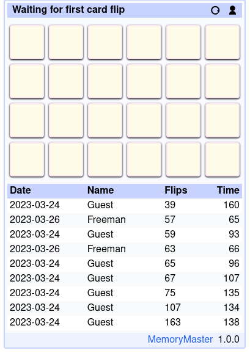

# Memory Master

Memory Master is a [Concentration](https://en.wikipedia.org/wiki/Concentration_(card_game)) card game.

Play the game on [https://memory-master.web-apps.top](https://memory-master.web-apps.top)



Memory Master is built on top of [ButlerOS](https://github.com/ButlerOS/haskell-butler).

The game state is managed server side, the game UI is built server side too and the
client's display (browser) leverages [hypermedia](https://htmx.org/essays/hypermedia-driven-applications/) via [htmx](https://htmx.org/).

## Start Memory Master via the nix flake

Run from the nix flake:

```
nix run github:web-apps-lab/MemoryMaster
firefox https://127.0.0.1:8085
```

Or from the local checkout

```
nix run .#
firefox https://127.0.0.1:8085
```

## Hack on the code

```Shell
# Enter the nix develop shell
nix develop

# Start ghicd with
bin/run-ghcid

# Open the browser to get interactive feedback
firefox https://127.0.0.1:8085

# Run your code editor in the nix shell
code .
```